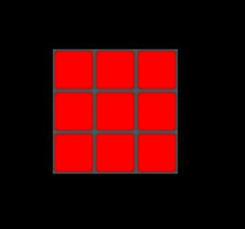
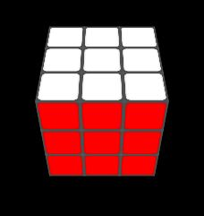
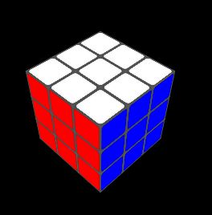
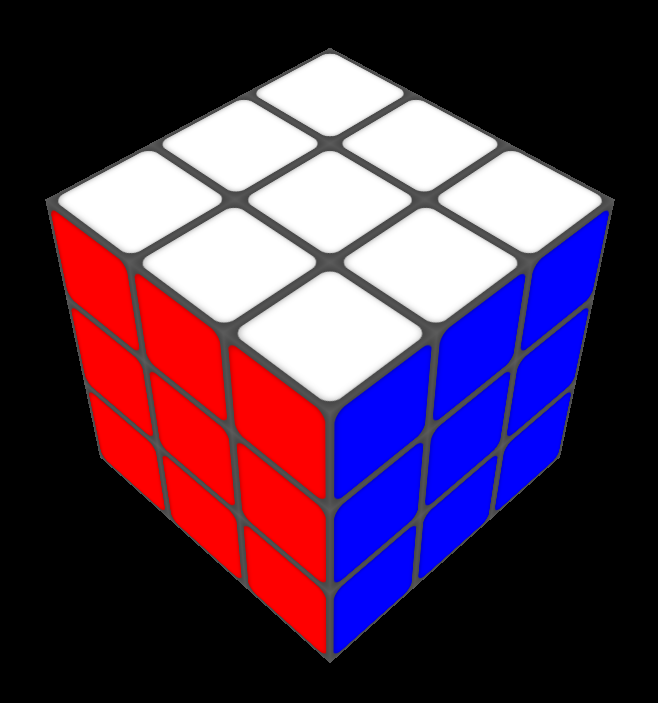
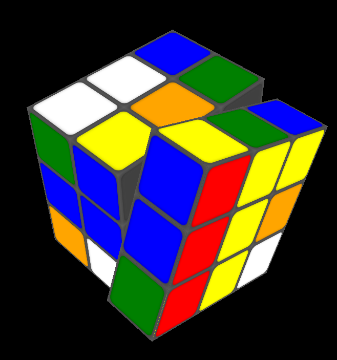

# Changes by Christer Nilsson

Added six [macros](https://www.geeksforgeeks.org/algorithm-to-solve-rubiks-cube/):
key|macro
-|-
3|R U R’ U’
4|U R U’ R’ U’ F’ U F
5|U’ L’ U L U F U’ F’
6|F R U R’ U’ F’ 
7|U R U’ L’ U R’ U’ L
8|U R’ U’ R

## Translation table
paper|code|desc
-|-|-
U|u|Up clockwise
U’|U|Up anti clockwise
R|r|Right
R’|R|
L|l|Left
L’|L|
F|f|Front
F’|F|

## Resulting table
key|macro|period length|pattern
-|-|-:|-
3| rt RU       | 6|4 corners and 3 edges are cycled
4| ur UR UF uf |15|4 corners and 5 edges are cycled
5| UL ul uf UF |15|4 corners and 5 edges are cycled
6| fru RUF     | 6|4 corners and 4 edges are cycled
7| ur UL u RU l| 3|3 corners are cycled
8| u RU r      | 6|4 corners and 3 edges are cycled

The original code associated letters with colors.  
This makes it harder to remember the macros.  
E.g. `r` and `R` always rotated the orange face.  
My idea is to first rotate the cube with the arrow keys and then apply the macro.  
I only accept positions where the colors are easy to spot.  
So, only 6*8 of 64 positions are possible to use.  
These where you can see two or three sides.  

# Rubik's Cube

This is Rubik's Cube made mainly with 3-dimensional CSS transforms and a bit of JavaScript (Svelte) to execute them. No WebGL or libraries such as Three.js are used.

https://rubikscubesvelte.netlify.app

  
Open the menu with the `i` key to see all the keys for rotating the cube and its layers.

When many rotations are entered quickly in a row, a queue executes them one by one. There are also options to undo moves, scramble the cube, reset the cube, zoom, or make the cube transparent.

This is the Svelte version of a previous version which you can find here: https://github.com/ScriptRaccoon/RubiksCubeCSS
